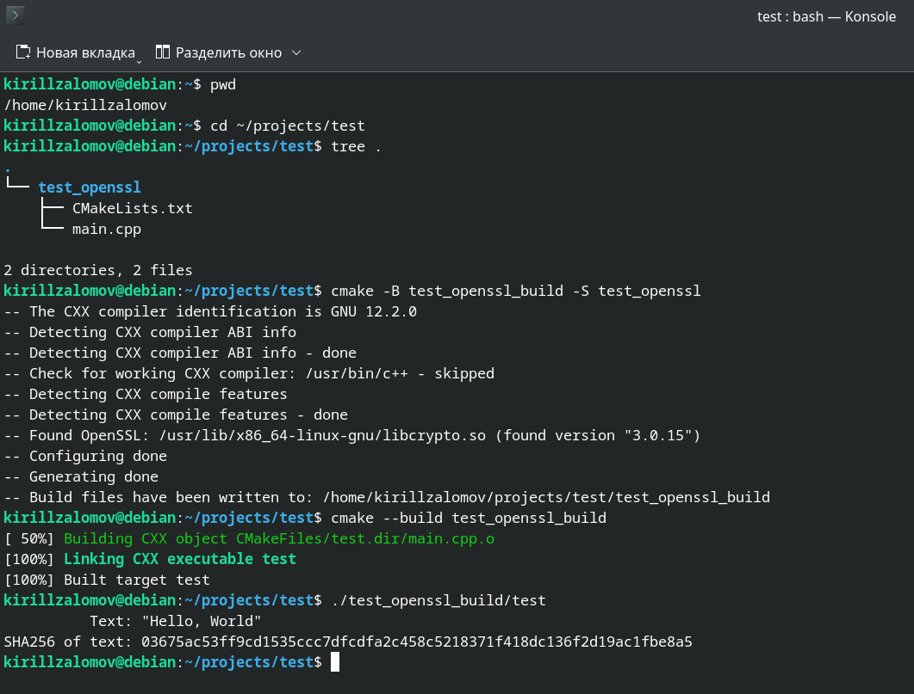

## Добавление библиотеки OpenSSL к проекту на C++ с CMake  

---

_Примечание:_ все практические примеры, приведённые в статье, выполнялись на ОС Debian 12 Bookworm.  

---

<br>  

## Оглавление

1. [Проверка доступности пакета OpenSSL в apt](#сhapter_1)
2. [Установка пакета OpenSSL через apt](#сhapter_2)
3. [Документация по OpenSSL](#сhapter_3)
4. [Добавление OpenSSL в проект на C++ с системой сборки CMake](#сhapter_4)
5. [Пример проекта для тестирования работы OpenSSL](#сhapter_5)
<br>  

---

<a name="сhapter_1"></a> 
### 1) Проверка доступности пакета OpenSSL в apt

Для установки пакета OpenSSL сначала нужно проверить его доступность:

```console
apt policy libssl-dev
```

Примерный вывод команды, сигнализирующий о доступности пакета:

```console
kirillzalomov@debian:~$ apt policy libssl-dev
libssl-dev:
  Установлен: (отсутствует)
  Кандидат:   3.0.15-1~deb12u1
  Таблица версий:
 *** 3.0.15-1~deb12u1 500
        500 http://deb.debian.org/debian bookworm/main amd64 Packages
        100 /var/lib/dpkg/status
     3.0.14-1~deb12u2 500
        500 http://security.debian.org/debian-security bookworm-security/main amd64 Packages

```

Если пакет будет не доступен, то вывод команды будет примерно таким:

```console
kirillzalomov@debian:~$ apt policy libssl-dev
libssl-dev:
  Установлен: (отсутствует)
  Кандидат:   (отсутствует)
  Таблица версий:
```

Или таким:

```console
kirillzalomov@debian:~$ apt policy libssl-dev
N: Невозможно найти пакет libssl-dev
```

<br>  
<br>  

---

<a name="сhapter_2"></a>
### 2) Установка пакета OpenSSL через apt  

Для установки можно воспользоваться командой:

```console
sudo apt install libssl-dev -y
```

<br>  
<br>  

---

<a name="сhapter_3"></a>
### 3) Документация по OpenSSL  

Библиотека OpenSSL состоит из двух компонентов:  
* __OpenSSL::SSL__ -- Используйте для работы с защищенными сетевыми соединениями (например, HTTPS).  
* __OpenSSL::Crypto__ -- Используйте для выполнения криптографических операций, таких как шифрование, хеширование и работа с цифровыми подписями.  

Про каждый из компонентов в отдельности можно почитать с помощью __man__:

```console
man ssl
man crypto
```

Также документация доступна по ссылке: [https://docs.openssl.org/master/man7/](https://docs.openssl.org/master/man7/)

<br>  
<br>  

---

<a name="сhapter_4"></a>
### 4) Добавление OpenSSL в проект на C++ с системой сборки CMake  

Для добавления OpenSSL в проект с CMake в файле CMakeLists.txt нужно указать:  

```cmake
find_package(OpenSSL REQUIRED)

add_executable(...)

target_link_libraries(test PRIVATE OpenSSL::SSL OpenSSL::Crypto)
```

<br>  
<br>  

---

<a name="сhapter_5"></a>
### 5) Пример проекта для тестирования работы OpenSSL  

_Примечание:_ исходный код приведённого примера можно взять здесь: [projects/test_openssl](projects/test_openssl)

Создадим проект, который будет выводить хеш-сумму по алгоритму SHA256 для текста "Hello, World".  

Создадим в папке __test__ проект __test_openssl__ c использованием системы сборки __CMake__. Демонстрационный проект будет состоять из двух файлов:  

* CMakeLists.txt

```cmake
cmake_minimum_required(VERSION 3.5)

project(test LANGUAGES CXX)

set(CMAKE_CXX_STANDARD 17)
set(CMAKE_CXX_STANDARD_REQUIRED ON)

find_package(OpenSSL REQUIRED)
add_executable(test main.cpp)
target_link_libraries(test PRIVATE OpenSSL::Crypto)
```

* main.cpp

```cpp
#include <iostream>
#include <iomanip>
#include <cstdint>
#include <openssl/sha.h>


int main() {
    // Текст, для которого будет вычисляться хеш по алгоритму HA256
    const std::string input = "Hello, World";

    // Массив для хранения хеша
    uint8_t hash[SHA256_DIGEST_LENGTH];

    // Вычисляем SHA256
    SHA256(reinterpret_cast<const unsigned char*>(input.c_str()), input.size(), hash);

    // Выводим исходный текст
    std::cout << std::setw(16) << "Text: " << "\"" << input << "\"" << std::endl;

    // Выводим хеш SHA256 для текста "Hello, World"
    std::cout << std::setw(16) << "SHA256 of text: ";
    for (int i = 0; i < SHA256_DIGEST_LENGTH; ++i) {
        std::cout << std::hex << std::setw(2) << std::setfill('0') << static_cast<int>(hash[i]);
    }
    std::cout << std::endl;

    return 0;
}
```

Выполним сборку проекта из папки __test__ и запустим программу (рисунок 1):

```console
cmake -B test_openssl_build -S test_openssl
cmake --build test_openssl_build
./test_openssl_build/test
```


Рисунок 1 --- Сборка проекта и запуск исполняемого файла __test__  

<br>  
<br>  

---
