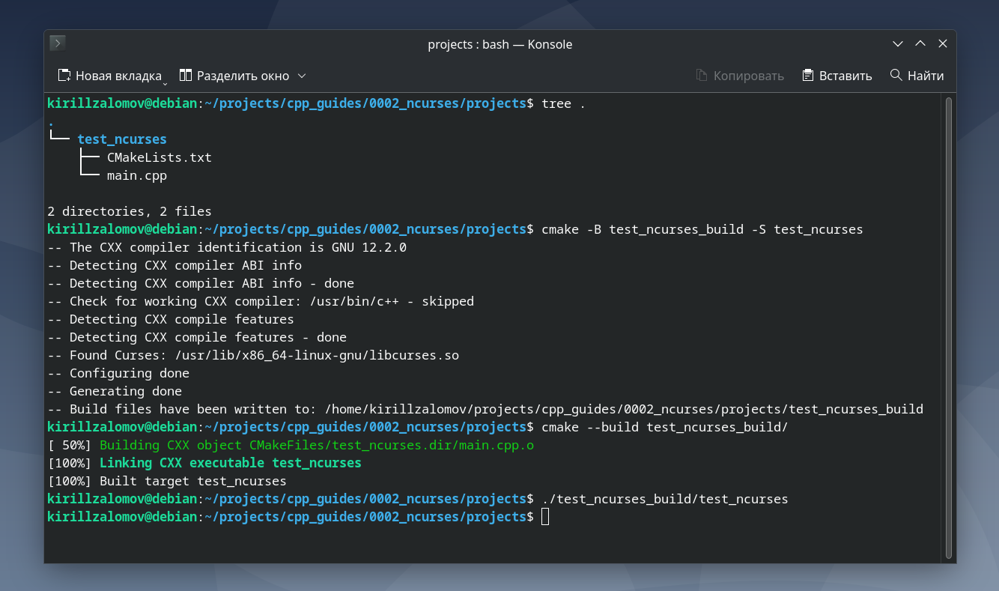
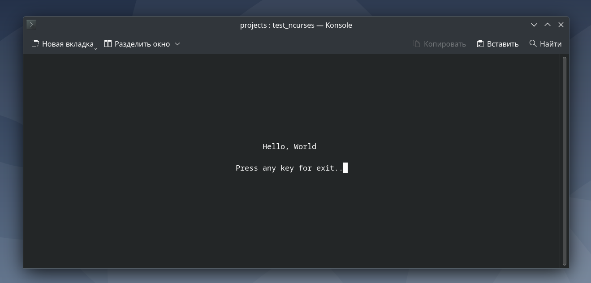

## Добавление библиотеки NCurses к проекту на C++ с CMake  

---

_Примечание:_ все практические примеры, приведённые в статье, выполнялись на ОС Debian 12 Bookworm.  

---

<br>  

## Оглавление

1. [Проверка доступности пакета NCurses в apt](#сhapter_1)
2. [Установка пакета NCurses через apt](#сhapter_2)
3. [Документация по NCurses](#сhapter_3)
4. [Добавление NCurses в проект на C++ с системой сборки CMake](#сhapter_4)
5. [Пример проекта для тестирования работы NCurses](#сhapter_5)
<br>  

---

<a name="сhapter_1"></a> 
### 1) Проверка доступности пакета NCurses в apt

Для установки пакета NCurses сначала нужно проверить его доступность:

```console
apt policy libncurses-dev
```

Примерный вывод команды, сигнализирующий о доступности пакета:

```console
kirillzalomov@debian:~$ apt policy libncurses-dev
libncurses-dev:
  Установлен: (отсутствует)
  Кандидат:   6.4-4
  Таблица версий:
 *** 6.4-4 500
        500 http://deb.debian.org/debian bookworm/main amd64 Packages
        100 /var/lib/dpkg/status

```

Если пакет будет не доступен, то вывод команды будет примерно таким:

```console
kirillzalomov@debian:~$ apt policy libncurses-dev
libncurses-dev:
  Установлен: (отсутствует)
  Кандидат:   (отсутствует)
  Таблица версий:
```

Или таким:

```console
kirillzalomov@debian:~$ apt policy libncurses-dev
N: Невозможно найти пакет libncurses-dev
```

<br>  
<br>  

---

<a name="сhapter_2"></a>
### 2) Установка пакета NCurses через apt  

Для установки можно воспользоваться командой:

```console
sudo apt install libncurses-dev ncurses-doc -y
```

<br>  
<br>  

---

<a name="сhapter_3"></a>
### 3) Документация по NCurses  

Online-документация доступна на: [tldp.org](https://tldp.org/HOWTO/NCURSES-Programming-HOWTO/).


Offline-документация доступна через __man__:

```console
man ncurses

# Для offline-документации через apt должен быть
# обязательно скачан пакет ncurses-doc
```

<br>  
<br>  

---

<a name="сhapter_4"></a>
### 4) Добавление NCurses в проект на C++ с системой сборки CMake  

Для добавления NCurses в проект с CMake в файле CMakeLists.txt нужно указать:  

```cmake
find_package(Curses REQUIRED)
include_directories(${CURSES_INCLUDE_DIR})

add_executable(...)

target_link_libraries(test_ncurses PRIVATE ${CURSES_LIBRARY})
```

<br>  
<br>  

---

<a name="сhapter_5"></a>
### 5) Пример проекта для тестирования работы NCurses  

_Примечание:_ исходный код приведённого примера можно взять здесь: [projects/test_ncurses](projects/test_ncurses)

Разработаем программу, которая будет выводить посередине терминала текст "Hello, World".  

Создадим папку __test_ncurses__ для тестового проекта. Папка должна содержать два файла:  

* CMakeLists.txt

```cmake
cmake_minimum_required(VERSION 3.5)

project(test_ncurses LANGUAGES CXX)

set(CMAKE_CXX_STANDARD 17)
set(CMAKE_CXX_STANDARD_REQUIRED ON)
add_compile_options(-Wall)

find_package(Curses REQUIRED)
include_directories(${CURSES_INCLUDE_DIR})

add_executable(test_ncurses main.cpp)
target_link_libraries(test_ncurses PRIVATE ${CURSES_LIBRARY})
```

* main.cpp

```cpp
#include <ncurses.h>
#include <string>
#include <cstdint>


int main() {
    initscr();
    noecho();
    cbreak();

    // Получаем размеры окна
    uint32_t height, width;
    getmaxyx(stdscr, height, width);

    // Тексты для отображения
    std::string line1 = "Hello, World";
    std::string line2 = "Press any key for exit..";

    // Вычисляем позиции для центрирования текста
    uint32_t x1 = (width - line1.length()) / 2;
    uint32_t y1 = height / 2 - 1;
    uint32_t x2 = (width - line2.length()) / 2;
    uint32_t y2 = height / 2 + 1;

    // Выводим текст
    mvprintw(y1, x1, line1.c_str());
    mvprintw(y2, x2, line2.c_str());
    refresh();
    
    // Ожидание нажатия любой клавиши для завершения программы
    getch();   
    endwin();

    return 0;
}
```

Выполним сборку проекта и запустим программу (рисунок 1):

```console
cmake -B test_ncurses_build -S test_ncurses
cmake --build test_ncurses_build
./test_ncurses_build/test_ncurses
```


Рисунок 1 --- Сборка проекта и запуск исполняемого файла __test_ncurses__  

Программа должна вывести следующее сообщение (рисунок 2):


Рисунок 2 --- Вывод программы __test_ncurses__  

<br>  
<br>  

---
