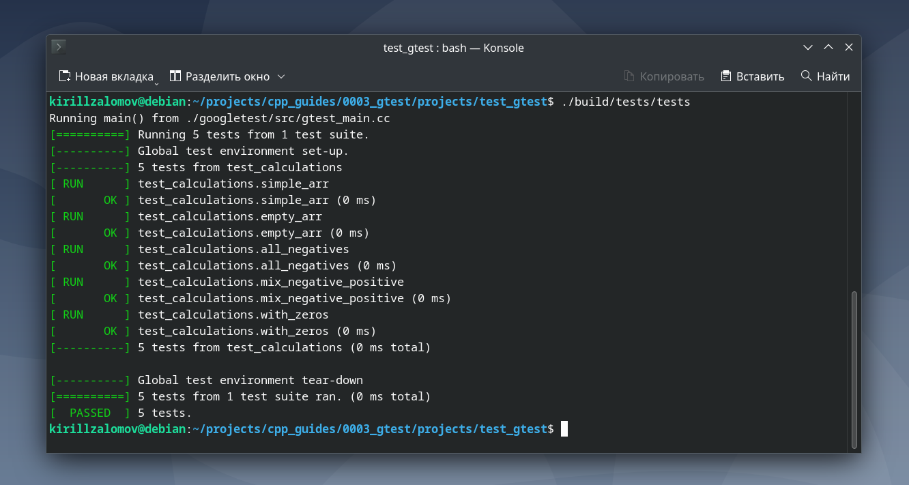

## Добавление библиотеки GTest к проекту на C++ с CMake  

---

_Примечание:_ все практические примеры, приведённые в статье, выполнялись на ОС Debian 12 Bookworm.  

---

<br>  

## Оглавление

1. [Установка пакета GTest через apt](#сhapter_1)
2. [Документация по GTest](#сhapter_2)
3. [Добавление GTest в проект на C++ с системой сборки CMake](#сhapter_3)
4. [Пример проекта для тестирования работы GTest](#сhapter_4)
<br>  

---

<a name="сhapter_1"></a>
### 1) Установка пакета GTest через apt  

Для установки можно воспользоваться командой:

```console
sudo apt install libgtest-dev -y
```

<br>  
<br>  

---

<a name="сhapter_2"></a>
### 2) Документация по GTest  

Online-документация доступна на: [google.github.io](https://google.github.io/googletest/).  

Также полезными материалами являются:  
* [www.geeksforgeeks.org](https://www.geeksforgeeks.org/gtest-framework/)
* [habr.com](https://habr.com/ru/articles/667880/)
* [habr.com](https://habr.com/ru/articles/119090/)
* [oop.afti.ru](https://oop.afti.ru/materials/41?ysclid=m7am4aeuil692328196)

<br>  
<br>  

---

<a name="сhapter_3"></a>
### 3) Добавление GTest в проект на C++ с системой сборки CMake  

Для добавления GTest в проект с CMake лучше всего создать подмодуль со своим собственным в файлом CMakeLists.txt. В файле CMakeLists.txt нужно указать:  

```cmake
project(<название_модуля_для_тестирования>)

add_executable(${PROJECT_NAME} <cpp-файлы_тестов>)

target_link_libraries(${PROJECT_NAME} PRIVATE
    <тестируемый_модуль>
    gtest
    gtest_main
)
```

<br>  
<br>  

---

<a name="сhapter_4"></a>
### 4) Пример проекта для тестирования работы GTest  

_Примечание:_ исходный код примера можно взять здесь: [projects/test_gtest](projects/test_gtest)  

Выполним сборку проекта (рисунок 1). Сборка происходить внутри папки проекта:  

```console
cmake -B ./build -S .
cmake --build build
```


Рисунок 1 --- Сборка проекта с GTest __test_ncurses__  

Запустим тесты:  

```console
./build/tests/tests
```

Программа после запуска тестов должна вывести следующее сообщение (рисунок 2):


Рисунок 2 --- Вывод программы __tests__  

<br>  
<br>  

---
