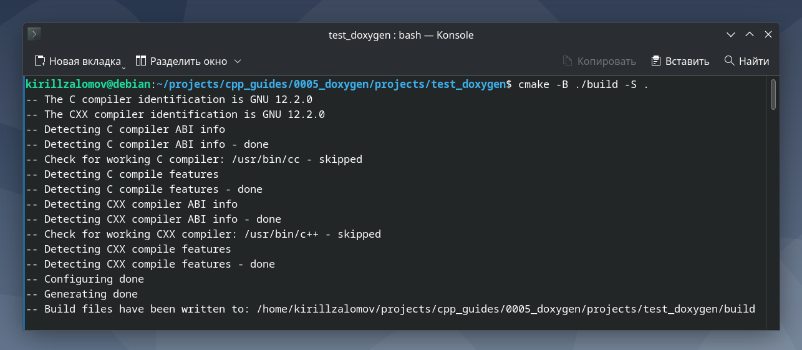
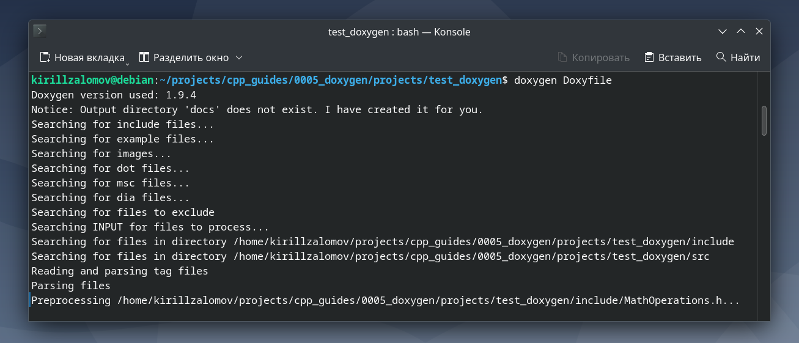
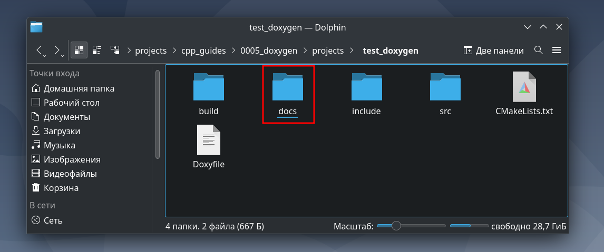
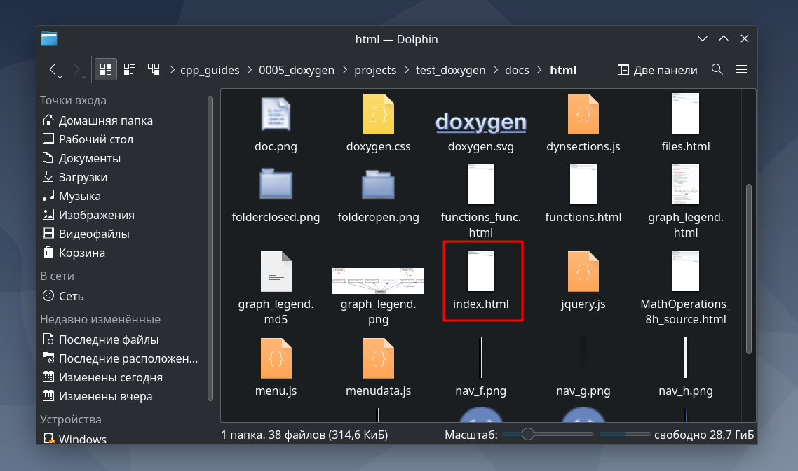
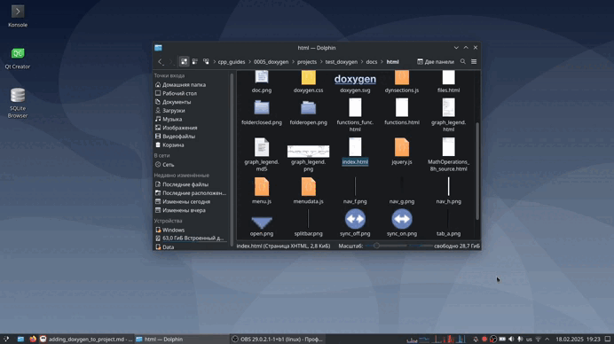

## Добавление библиотеки Doxygen к проекту на C++ с CMake  

---

_Примечание:_ все практические примеры, приведённые в статье, выполнялись на ОС Debian 12 Bookworm.  

---

<br>  

## Оглавление

1. [Установка пакета Doxygen через apt](#сhapter_1)
2. [Документация по Doxygen](#сhapter_2)
3. [Добавление Doxygen в проект на C++ с системой сборки CMake](#сhapter_3)
4. [Пример проекта для тестирования работы Doxygen](#сhapter_4)
<br>  

---

<a name="сhapter_1"></a>
### 1) Установка пакета Doxygen через apt  

Для установки можно воспользоваться командой:

```console
sudo apt install doxygen -y
```

<br>  
<br>  

---

<a name="сhapter_2"></a>
### 2) Документация по Doxygen  

Online-документация доступна на: [doxygen.nl](https://doxygen.nl/manual/).

Также полезными источниками являются:
* [habr.com](https://habr.com/ru/articles/252101/)
* [habr.com](https://habr.com/ru/articles/799051/)
* [embeddedinventor.com](https://embeddedinventor.com/guide-to-configure-doxygen-to-document-c-source-code-for-beginners/)
* [eax.me](https://eax.me/doxygen/)
* [www.geeksforgeeks.org](https://www.geeksforgeeks.org/doxygen-cpp-documentation/?ysclid=m7a8hnnu8k189070259)

Offline-документация доступна через __man__:

```console
man doxygen
man doxywizard
```

_Примечание:_ лучше использовать документацию из online-источников, поскольку она более информативная и позволяет получить исчерпывающий ответ по интересующей теме.

<br>  
<br>  

---

<a name="сhapter_3"></a>
### 3) Добавление Doxygen в проект на C++ с системой сборки CMake  

Для добавления Doxygen в проект следует добавить в папку с проектом файл Doxyfile. Пример содержания Doxyfile:  

```ini
# Doxyfile 1.8.20

PROJECT_NAME           = <Имя_проекта>
PROJECT_BRIEF          = <Краткое_описание_проекта>
OUTPUT_DIRECTORY       = <Папка_куда_будет_сохранена_документация>
INPUT                  = <Перечисление_папок_с_исходными_кодами>
RECURSIVE              = YES
GENERATE_HTML          = YES
GENERATE_LATEX         = NO 
```

<br>  
<br>  

---

<a name="сhapter_4"></a>
### 4) Пример проекта для тестирования работы Doxygen  

_Примечание:_ исходный код приведённого примера можно взять здесь: [projects/test_doxygen](projects/test_doxygen)

Выполним сборку проекта (рисунок 1):

```cmake
cmake -B ./build -S .
cmake --build build
```

  
Рисунок 1 --- Сборка проекта   

Запустим Doxygen для автоматической генерации документации (рисунок 2):
```console
doxygen Doxyfile
```

  
Рисунок 2 --- Запуск Doxygen  

После завершения генерации документации в папке с проектом появится папка __docs__ (рисунок 3):

  
Рисунок 3 --- Появившаяся папка с документацией  

Для просмотра документации можно открыть файл __index.html__ (рисунок 4):

  
Рисунок 4 --- Файл __index.html__ в папке __docs/html__  

После открытия файла __index.html__ в браузере можно будет увидеть документацию (рисунок 5):

  
Рисунок 5 --- Документация, открытая в браузере  

<br>  
<br>  

---
