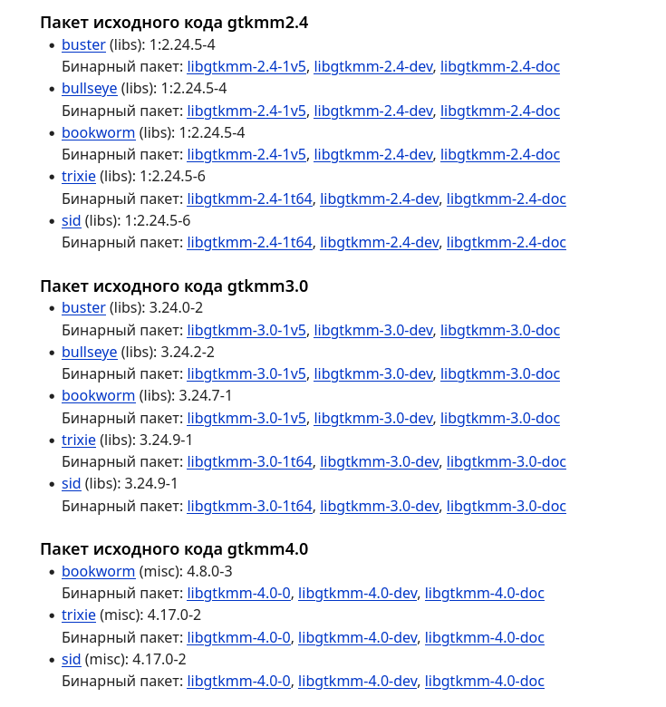
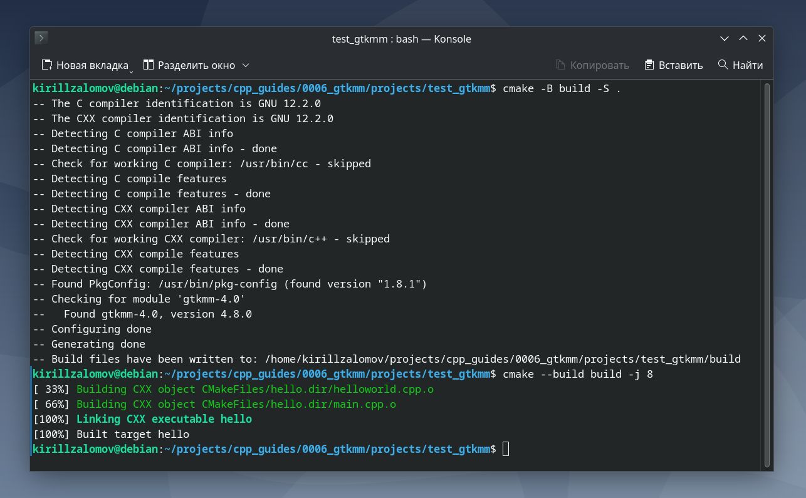
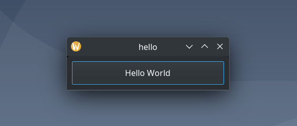

## Добавление библиотеки gtkmm к проекту на C++ с CMake  

---  

_Примечание:_ все практические примеры, приведённые в статье, выполнялись на ОС Debian 12 Bookworm.  

---  

<br>  

## Оглавление

1. [Поиск новейшей версии gtkmm](#сhapter_1)
2. [Установка пакета gtkmm через apt](#сhapter_2)
3. [Документация по gtkmm](#сhapter_3)
4. [Добавление gtkmm в проект на C++ с системой сборки CMake](#сhapter_4)
5. [Пример проекта для тестирования работы gtkmm](#сhapter_5)
<br>  

---

<a name="сhapter_1"></a>
### 1) Поиск новейшей версии gtkmm  

На момент написания статьи (февраль 2025 г.) актуальной версией пакета для разработки программ с gtkmm является версия 4.8.0.  

Найти самую актуальную версию можно по ссылке:  
https://packages.debian.org/search?searchon=sourcenames&keywords=gtkmm  

Как видно из информации на сайте (рисунок 1), все пакеты разработки имеют название в стиле: __libgtkmm-\<version\>-dev__.  

  
Рисунок 1 --- Информация о версия gtkmm с сайта packages.debian.org  

Найдём через менеджер зависимостей __apt__ доступные пакеты:

```console
kirillzalomov@debian:~$ apt policy libgtkmm-*-dev
libgtkmm-3.0-dev:
  Установлен: (отсутствует)
  Кандидат:   3.24.7-1
  Таблица версий:
     3.24.7-1 500
        500 http://deb.debian.org/debian bookworm/main amd64 Packages
libgtkmm-2.4-dev:
  Установлен: (отсутствует)
  Кандидат:   1:2.24.5-4+b1
  Таблица версий:
     1:2.24.5-4+b1 500
        500 http://deb.debian.org/debian bookworm/main amd64 Packages
libgtkmm-4.0-dev:
  Установлен: (отсутствует)
  Кандидат:   4.8.0-3
  Таблица версий:
 *** 4.8.0-3 500
        500 http://deb.debian.org/debian bookworm/main amd64 Packages
        100 /var/lib/dpkg/status
```

Из полученного сообщения следует, что актуальной версией gtkmm на момент написания статьи является версия __4.8.0-3__. 

<br>  
<br>  

---

<a name="сhapter_2"></a>
### 2) Установка пакета gtkmm через apt  

Для установки можно воспользоваться командой:

```console
sudo apt install libgtkmm-4.0-dev libgtkmm-4.0-doc -y
```

<br>  
<br>  

---

<a name="сhapter_3"></a>
### 3) Документация по gtkmm  

Online-документация доступна на:  
https://gnome.pages.gitlab.gnome.org/gtkmm-documentation/  

Также полезной ссылкой может быть:  
https://gtkmm.gnome.org/en/documentation.html  

<br>  
<br>  

---

<a name="сhapter_4"></a>
### 4) Добавление gtkmm в проект на C++ с системой сборки CMake  

Для добавления gtkmm в проект с CMake в файле CMakeLists.txt нужно указать:  

```cmake
# Минимальная версия стандарта для gtkmm 4.0
set(CMAKE_CXX_STANDARD 17)
set(CMAKE_CXX_STANDARD_REQUIRED ON)

find_package(PkgConfig REQUIRED)
pkg_check_modules(GTKMM REQUIRED gtkmm-4.0)
include_directories(${GTKMM_INCLUDE_DIRS})

add_executable(<executable> <sources>)
target_link_libraries(hello ${GTKMM_LIBRARIES})
```

<br>  
<br>  

---

<a name="сhapter_5"></a>
### 5) Пример проекта для тестирования работы gtkmm  

_Примечание:_ исходный код примера можно взять здесь:  
[projects/test_gtkmm](projects/test_gtkmm).  
Пример взят с:  
https://gnome.pages.gitlab.gnome.org/gtkmm-documentation/sec-helloworld.html  

Выполним сборку проекта (рисунок 2). Сборка происходить внутри папки проекта:  

```console
cmake -B build -S .
cmake --build build
```

  
Рисунок 2 --- Сборка проекта с gtkmm  

Запустим программу __hello__ (рисунок 3):  

```console
./build/hello
```

  
Рисунок 3 --- Программа __hello__  

<br>  
<br>  

---
