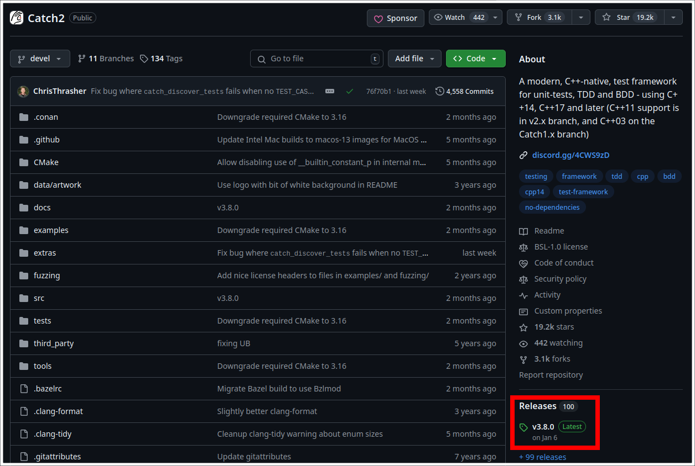
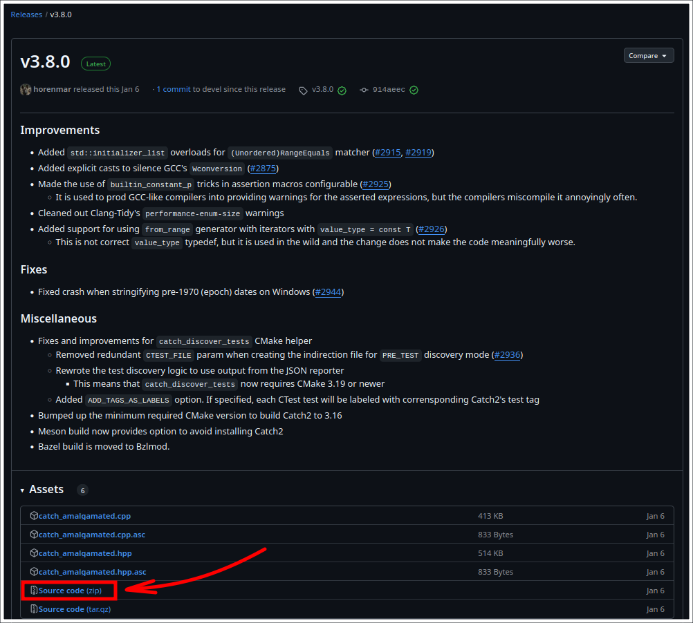
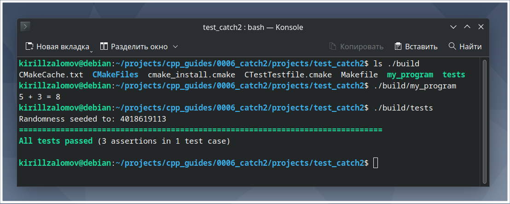

## Добавление библиотеки Catch2 к проекту на C++ с CMake  

---  

_Примечание:_ все практические примеры, приведённые в статье, выполнялись на ОС Debian 12 Bookworm.  

---  

<br>  

## Оглавление

1. [Поиск новейшей версии Catch2](#сhapter_1)
2. [Установка библиотеки Catch2](#сhapter_2)
3. [Документация по Catch2](#сhapter_3)
4. [Добавление Catch2 в проект на C++ с системой сборки CMake](#сhapter_4)
5. [Пример проекта для тестирования работы Catch2](#сhapter_5)
<br>  

---

<a name="сhapter_1"></a>
### 1) Поиск новейшей версии Catch2  

Библиотеку можно скачать с официальной страницы на [github.com](https://github.com/catchorg/Catch2?ysclid=m8hh1u17y5597839704) (рисунок 1).  

  
Рисунок 1 --- Последняя Release-версия библиотеки на странице github  

<br>  
<br>  

---

<a name="сhapter_2"></a>
### 2) Установка библиотеки Catch2  

Рекомендуется на странице проекта на github выбрать последнюю Release-версию (рисунок 1) и скачать zip-архив с исходными кодами библиотеки (рисунок 2) для её установки в системе.  

  
Рисунок 2 --- Исходные коды библиотеки, доступные в виде zip-архива  

После разархивации скачанного zip-архива в желаемую папку необходимо перейти в папку разархивированного проекта и выполнить следующие команды:  

```console
cmake -B build -S .
cmake --build build/ -j$(nproc)
cd build/
sudo make install
```

<br>  
<br>  

---

<a name="сhapter_3"></a>
### 3) Документация по Catch2  

Примеры использования библиотеки:  
https://github.com/catchorg/Catch2/blob/devel/docs/tutorial.md#top  

Полезный источник:  
https://catch2-temp.readthedocs.io/en/latest/  

Интеграция с CMake:  
https://github.com/catchorg/Catch2/blob/devel/docs/cmake-integration.md#top  

<br>  
<br>  

---

<a name="сhapter_4"></a>
### 4) Добавление Catch2 в проект на C++ с системой сборки CMake  

Для добавления Catch2 в проект с CMake в файле CMakeLists.txt нужно указать:  

```cmake
--------------------------------------------------------------------------------
find_package(Catch2 REQUIRED)
...
# В таком случае Catch2 автоматически предоставит точку входа (main)
# для тестов:
add_executable(tests test.cpp)
target_link_libraries(tests PRIVATE Catch2::Catch2WithMain)
--------------------------------------------------------------------------------

ИЛИ

--------------------------------------------------------------------------------
# В таком случае необходимо написать свою собственную точку входа (main)
# для тестов:
find_package(Catch2 REQUIRED)
...
add_executable(custom-main-tests test.cpp test-main.cpp)
target_link_libraries(custom-main-tests PRIVATE Catch2::Catch2)
--------------------------------------------------------------------------------
```

<br>  
<br>  

---

<a name="сhapter_5"></a>
### 5) Пример проекта для тестирования работы Catch2  

_Примечание:_ исходный код примера можно взять здесь:  
[projects/test_catch2](projects/test_catch2).  

Выполним сборку проекта (рисунок 3). Сборка происходить внутри папки проекта:  

```console
cmake -B build -S .
cmake --build build/ -j$(nproc)
```

  
Рисунок 3 --- Сборка проекта с catch2  

Запустим сначала саму прогамму __my_program__ и потом unit-тесты __tests__ (рисунок 4):  

```console
./build/my_program
./build/tests
```

  
Рисунок 4 --- Запуск программы и unit-тестов  

<br>  
<br>  

---
