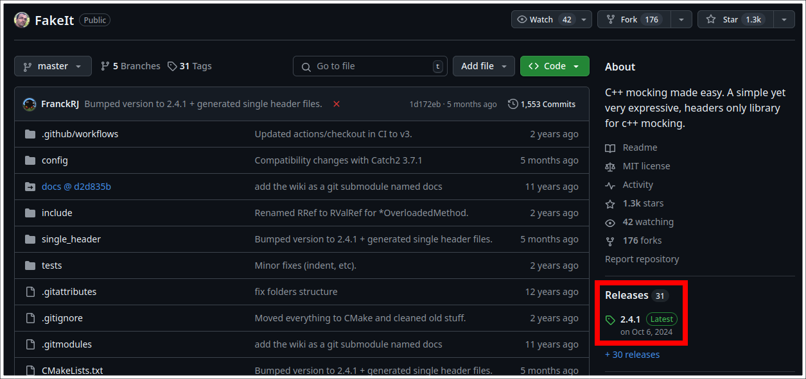
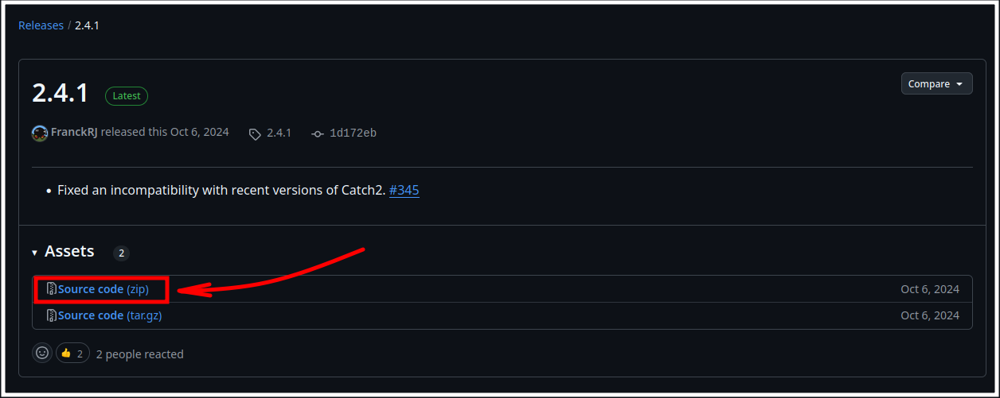
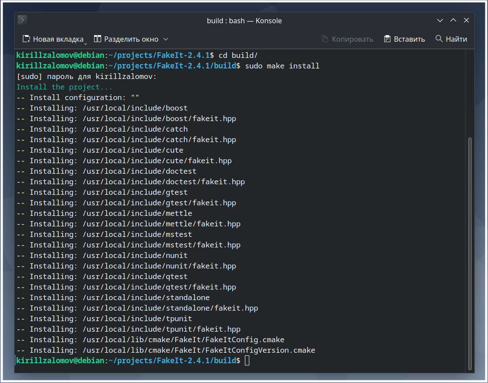
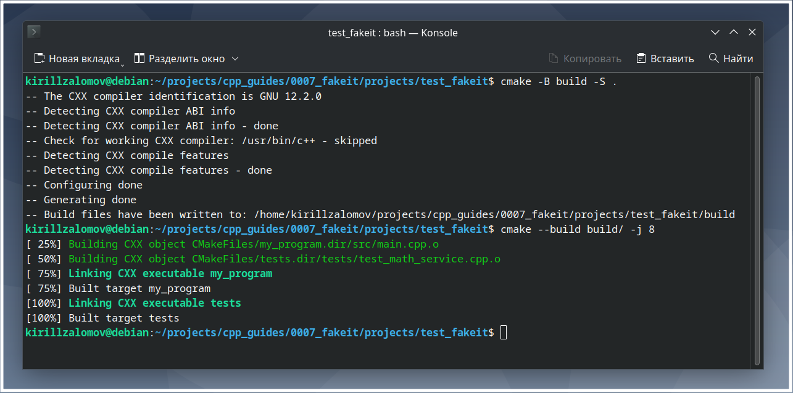
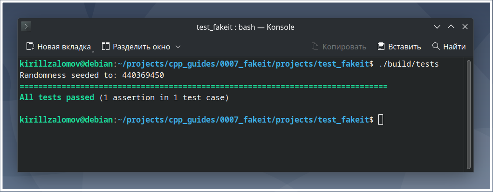

## Добавление библиотеки FakeIt к проекту на C++ с CMake  

---  

_Примечание:_ все практические примеры, приведённые в статье, выполнялись на ОС Debian 12 Bookworm.  

---  

<br>  

## Оглавление

1. [Поиск новейшей версии FakeIt](#сhapter_1)
2. [Установка библиотеки FakeIt](#сhapter_2)
3. [Документация по FakeIt](#сhapter_3)
4. [Добавление FakeIt в проект на C++ с системой сборки CMake](#сhapter_4)
5. [Пример проекта для тестирования работы FakeIt](#сhapter_5)
<br>  

---

<a name="сhapter_1"></a>
### 1) Поиск новейшей версии FakeIt  

Библиотеку можно скачать с официальной страницы на [github.com](https://github.com/eranpeer/FakeIt?ysclid=m8hirmi5jw275117939) (рисунок 1).  

  
Рисунок 1 --- Последняя Release-версия библиотеки на странице github  

<br>  
<br>  

---

<a name="сhapter_2"></a>
### 2) Установка библиотеки FakeIt  

Перед установкой необходимо сначала скачать библиотеку [Catch2](../0006_catch2/adding_catch2_to_project.md).

Рекомендуется на странице проекта на github выбрать последнюю Release-версию (рисунок 1) и скачать zip-архив с исходными кодами библиотеки (рисунок 2) для её установки в системе.  

  
Рисунок 2 --- Исходные коды библиотеки, доступные в виде zip-архива  

После разархивации скачанного zip-архива в желаемую папку необходимо перейти в папку разархивированного проекта и выполнить следующие команды (рисунок 3):  

```console
cmake -B build -S .
cmake --build build/ -j$(nproc)
cd build/
sudo make install
```

  
Рисунок 3 --- Установка библиотеки в систему  

<br>  
<br>  

---

<a name="сhapter_3"></a>
### 3) Документация по FakeIt  

Официальные примеры использования:
* https://github.com/eranpeer/FakeIt/wiki/Quickstart  

Полезные статьи с примерами использования:  
* https://noiseehc.blogspot.com/2022/01/this-is-written-version-of-presentation.html  
* https://programmersought.com/article/71898244073/  

<br>  
<br>  

---

<a name="сhapter_4"></a>
### 4) Добавление FakeIt в проект на C++ с системой сборки CMake  

Для добавления библиотеки совместно с Catch2 в проект с CMake в файле CMakeLists.txt нужно указать:  

```cmake
find_package(Catch2 REQUIRED)
include_directories(/usr/local/include/catch)

add_executable(tests <test_cpp_sources>)
target_link_libraries(tests PRIVATE Catch2::Catch2WithMain)

enable_testing()
add_test(NAME tests COMMAND tests)
```

<br>  
<br>  

---

<a name="сhapter_5"></a>
### 5) Пример проекта для тестирования работы FakeIt  

_Примечание:_ исходный код примера можно взять здесь:  
[projects/test_fakeit](projects/test_fakeit).  

Выполним сборку проекта (рисунок 4). Сборка происходить внутри папки проекта:  

```console
cmake -B build -S .
cmake --build build/ -j$(nproc)
```

  
Рисунок 4 --- Сборка проекта с библиотеками Catch2 и FakeIt  

Запустим unit-тесты и mock-тесты __tests__ (рисунок 5):  

```console
./build/tests
```

  
Рисунок 5 --- Запуск unit- и mock-тестов  

<br>  
<br>  

---
