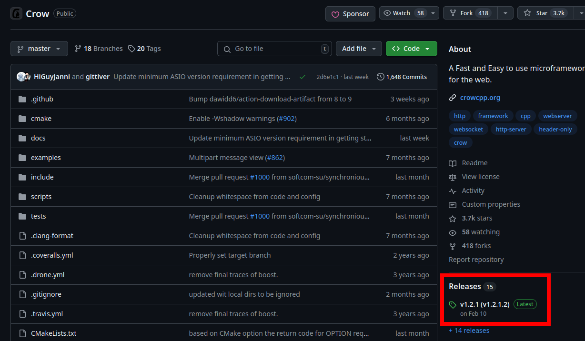
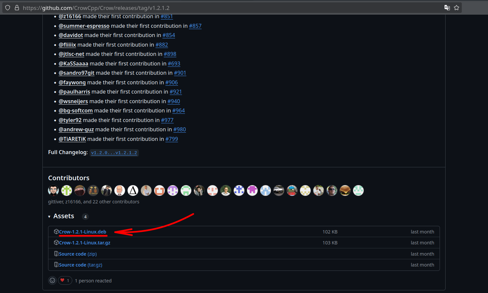
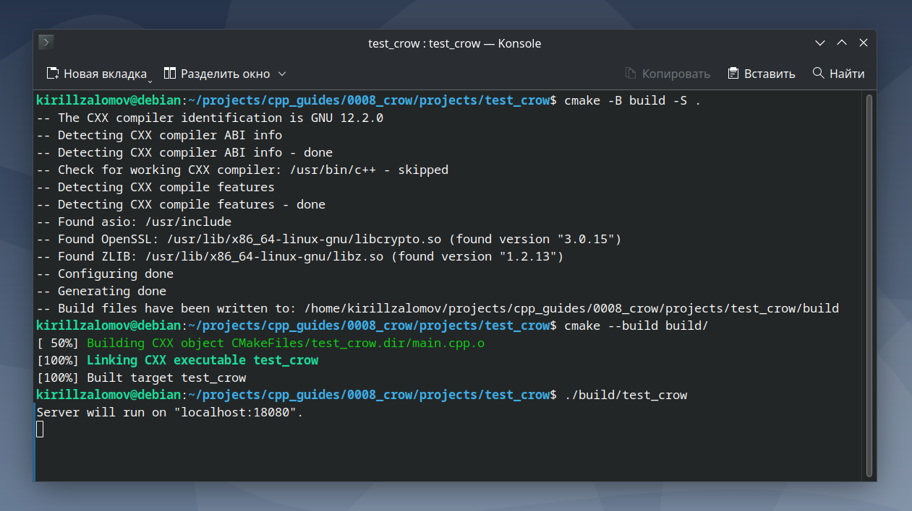
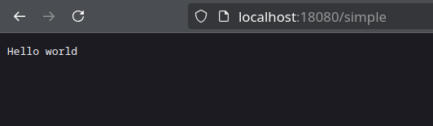

## Добавление библиотеки Crow к проекту на C++ с CMake  

---  

_Примечание:_ все практические примеры, приведённые в статье, выполнялись на ОС Debian 12 Bookworm.  

---  

<br>  

## Оглавление

1. [Поиск новейшей версии Crow](#сhapter_1)
2. [Установка библиотеки Crow](#сhapter_2)
3. [Документация по Crow](#сhapter_3)
4. [Добавление Crow в проект на C++ с системой сборки CMake](#сhapter_4)
5. [Пример проекта для тестирования работы Crow](#сhapter_5)
<br>  

---

<a name="сhapter_1"></a>
### 1) Поиск новейшей версии Crow  

Новейшая версия библиотеки всегда доступна на [github.com](https://github.com/CrowCpp/Crow). Самую последнюю Release-версию можно получить по ссылке на страницу в github (рисунок 1).  

  
Рисунок 1 --- Новейшая Release-версия библиотеки Crow  

<br>  
<br>  

---

<a name="сhapter_2"></a>
### 2) Установка библиотеки Crow  

Скачаем deb-файл на локальное устройство (рисунок 2):  

  
Рисунок 2 --- Скачивание deb-файла для установки Crow  

После скачивания deb-файла выполним установку:  

```console
sudo apt install -y libssl-dev zlib1g-dev
sudo dpkg -i Crow-1.2.1-Linux.deb

# Если после выполнения второй команды выявятся ошибки с зависимостями,
# выполнить следующее:
sudo apt install -f
sudo dpkg -i Crow-1.2.1-Linux.deb
```

<br>  
<br>  

---

<a name="сhapter_3"></a>
### 3) Документация по Crow  

Online-документация доступна по ссылкам:  
* https://crowcpp.org/master/getting_started/setup/linux/  
* https://crowcpp.org/master/guides/app/  

<br>  
<br>  

---

<a name="сhapter_4"></a>
### 4) Добавление Crow в проект на C++ с системой сборки CMake  

Для добавления Crow в проект с CMake в файле CMakeLists.txt нужно указать:  

```cmake
find_package(Crow REQUIRED)
find_package(OpenSSL REQUIRED)
find_package(ZLIB REQUIRED)
target_link_libraries(<app_name> Crow::Crow OpenSSL::SSL OpenSSL::Crypto ZLIB::ZLIB)
```

<br>  
<br>  

---

<a name="сhapter_5"></a>
### 5) Пример проекта для тестирования работы Crow  

_Примечание:_ исходный код примера можно взять здесь: [projects/test_crow](projects/test_crow).  

Выполним сборку проекта (рисунок 3). Сборка происходить внутри папки проекта.   

```console
cmake -B build -S .
cmake --build build/ -j$(nproc)
```

Запустим программу __test_crow__ (рисунок 3):

```console
./build/test_crow
```

  
Рисунок 3 --- Сборка проекта с Crow и запуск сервера  

Через браузер зайдём на адрес "localhost:18080/simple" и увидим результат, показанный на рисунке 4.

  
Рисунок 4 --- localhost:18080/simple  

<br>  
<br>  

---
