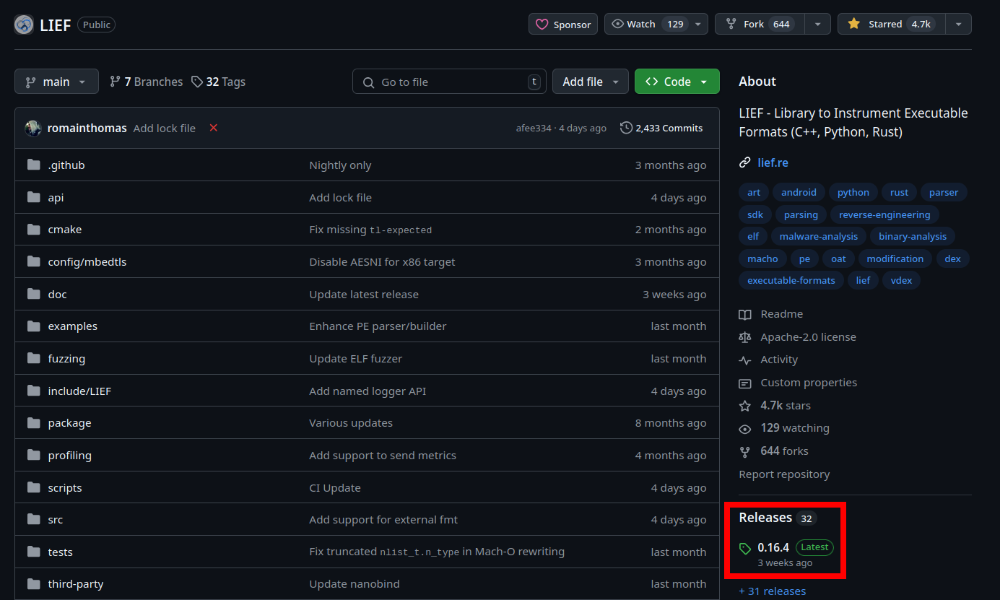
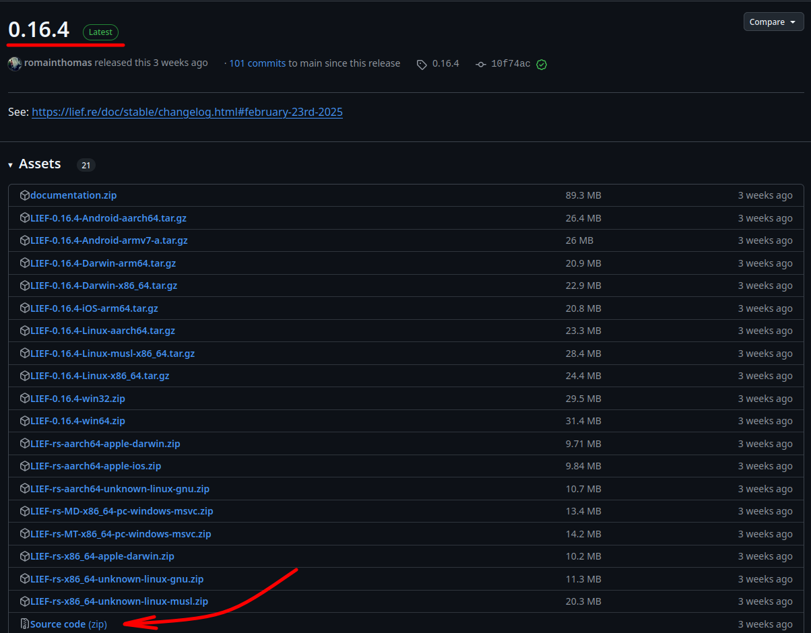
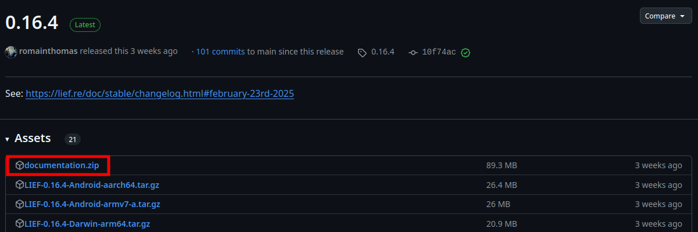
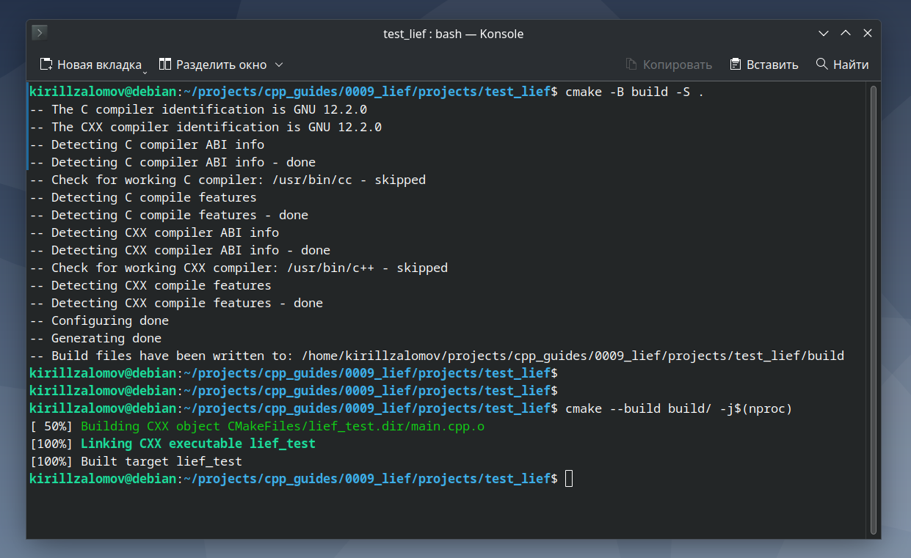
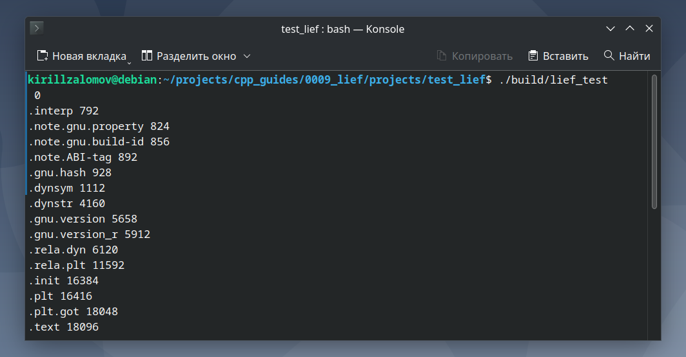

## Добавление библиотеки lief к проекту на C++ с CMake  

---  

_Примечание:_ все практические примеры, приведённые в статье, выполнялись на ОС Debian 12 Bookworm.  

---  

<br>  

## Оглавление

1. [Поиск новейшей версии lief](#сhapter_1)
2. [Установка библиотеки lief](#сhapter_2)
3. [Документация по lief](#сhapter_3)
4. [Добавление lief в проект на C++ с системой сборки CMake](#сhapter_4)
5. [Пример проекта для тестирования работы lief](#сhapter_5)
<br>  

---

<a name="сhapter_1"></a>
### 1) Поиск новейшей версии lief  

Новейшая версия библиотеки всегда доступна на [github.com](https://github.com/lief-project/LIEF). Самую последнюю версию ветки Release можно получить по ссылке на страницу в github (рисунок 1).  

  
Рисунок 1 --- Новейшая версия библиотеки lief в ветке Release  

<br>  
<br>  

---

<a name="сhapter_2"></a>
### 2) Установка библиотеки lief  

Скачаем проект на локальное устройство (рисунок 2):  

  
Рисунок 2 --- Скачивание проекта leif 0.16.4  

Разархивируем zip-архив с исходными кодами проекта. Перейдём в терминал и из папки проекта выполним сборку и установим библиотеку в систему:  

```console
cmake -B build -S .
cmake --build build/ -j$(nproc)
cd build
sudo make install
```

<br>  
<br>  

---

<a name="сhapter_3"></a>
### 3) Документация по leif  

Online-документация доступна по ссылке:  
https://lief.re/doc/stable/index.html  

Offline-документацию можно скачать в Release-ветке (рисунок 3):  

  
Рисунок 3 --- Скачивание offline-документации  

<br>  
<br>  

---

<a name="сhapter_4"></a>
### 4) Добавление lief в проект на C++ с системой сборки CMake  

Для добавления lief в проект с CMake в файле CMakeLists.txt нужно указать:  

```cmake
...
# COMPONENTS: <SHARED | STATIC> - Default: STATIC
set(LIEF_DIR "/usr/lib/cmake/LIEF/")
find_package(LIEF REQUIRED COMPONENTS STATIC)
...
target_link_libraries(<app-name> PRIVATE LIEF::LIEF)
...
```

<br>  
<br>  

---

<a name="сhapter_5"></a>
### 5) Пример проекта для тестирования работы lief  

_Примечание:_ исходный код примера можно взять здесь:  
[projects/test_lief](projects/test_lief).  

Выполним сборку проекта (рисунок 4). Сборка происходить внутри папки проекта:  

```console
cmake -B build -S .
cmake --build build/ -j$(nproc)
```

  
Рисунок 4 --- Сборка проекта с lief  

Запустим программу __lief_test__ (рисунок 5):  

```console
./build/lief_test
```

  
Рисунок 5 --- Программа __lief_test__  

<br>  
<br>  

---
