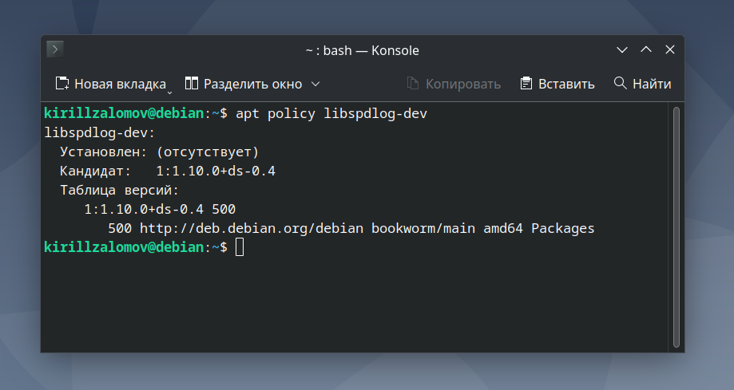
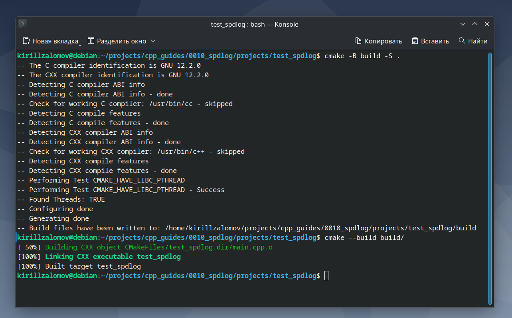
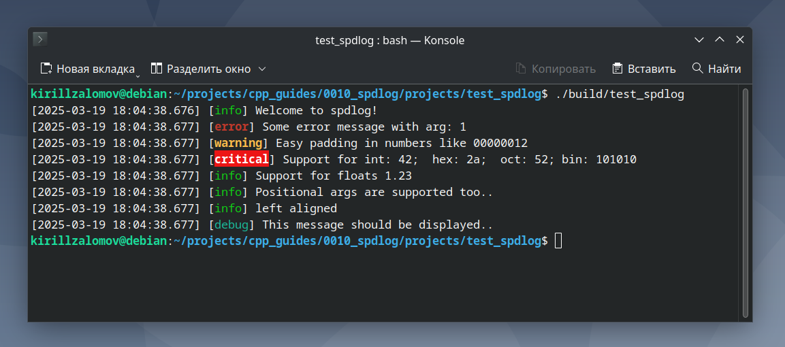

## Добавление библиотеки spdlog к проекту на C++ с CMake  

---  

_Примечание:_ все практические примеры, приведённые в статье, выполнялись на ОС Debian 12 Bookworm.  

---  

<br>  

## Оглавление

1. [Поиск новейшей версии spdlog](#сhapter_1)
2. [Установка библиотеки spdlog](#сhapter_2)
3. [Документация по spdlog](#сhapter_3)
4. [Добавление spdlog в проект на C++ с системой сборки CMake](#сhapter_4)
5. [Пример проекта для тестирования работы spdlog](#сhapter_5)
<br>  

---

<a name="сhapter_1"></a>
### 1) Поиск новейшей версии spdlog  

Библиотека __spdlog__ доступна в Release-ветке менеджера зависимостей __apt__ (рисунок 1).  

```console
apt policy libspdlog-dev
```

  
Рисунок 1 --- Проверка доступной версии библиотеки spdlog  

<br>  
<br>  

---

<a name="сhapter_2"></a>
### 2) Установка библиотеки spdlog  

Для скачивания библиотеки на Debian можно воспользоваться командой:  

```console
sudo apt install -y libspdlog-dev
```

<br>  
<br>  

---

<a name="сhapter_3"></a>
### 3) Документация по spdlog  

Примеры использования библиотеки:  
https://github.com/gabime/spdlog  

<br>  
<br>  

---

<a name="сhapter_4"></a>
### 4) Добавление spdlog в проект на C++ с системой сборки CMake  

Для добавления spdlog в проект с CMake в файле CMakeLists.txt нужно указать:  

```cmake
if(NOT TARGET spdlog)
    # Stand-alone build
    find_package(spdlog REQUIRED)
endif()

target_link_libraries(<app_name> PRIVATE spdlog::spdlog)
```

<br>  
<br>  

---

<a name="сhapter_5"></a>
### 5) Пример проекта для тестирования работы spdlog  

_Примечание:_ исходный код примера можно взять здесь:  
[projects/test_spdlog](projects/test_spdlog).  

Выполним сборку проекта (рисунок 2). Сборка происходить внутри папки проекта:  

```console
cmake -B build -S .
cmake --build build/ -j$(nproc)
```

  
Рисунок 2 --- Сборка проекта с spdlog  

Запустим программу __test_spdlog__ (рисунок 3):  

```console
./build/test_spdlog
```

  
Рисунок 3 --- Программа __test_spdlog__  

<br>  
<br>  

---
